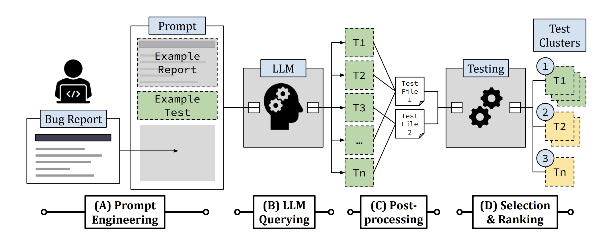

# LIBRO: LLM Induced Bug Reproduction


This repository contains a replicable artifact of a paper **Large Language Models are Few-shot Testers: Exploring LLM-based General Bug Reproduction** (to appear in ICSE 2023, [preprint available in arXiv](https://arxiv.org/abs/2209.11515))


LIBRO accepts a bug report and an existing test suite as input, and produces a ranked list of bug-reproducing test candidates.

## Setting up LIBRO 
* You need [Docker](https://docs.docker.com/get-docker/) to set up environment to run LIBRO. 

### Set OpenAI Key (Skip if you want to use our prepared query results)
Edit `env.list` file with your OpenAI API secret key.
```
OPENAI_API_KEY=<your_own_openai_api_key>
```
### (Option 1: Recommended) Pull Docker image
```bash 
docker pull greenmon/libro-env
```

Run docker container and attach to it:
```bash 
sh run_docker_container.sh
```

### (Option 2) Build Docker image on your own
Build docker image with Defects4J framework and proper Java/Python versions installed:
```bash 
cd docker
docker build -t libro-env .
```

Run docker container and attach to it:
```bash 
sh run_docker_container.sh
```

Inside the container:
```bash
wget https://archive.apache.org/dist/maven/maven-3/3.8.6/binaries/apache-maven-3.8.6-bin.tar.gz -P /tmp # for running projects in GHRB benchmark
tar -xzvf /tmp/apache-maven-3.8.6-bin.tar.gz -C /opt

git config --global --add safe.directory '*'

cd workspace
pip install -r requirements.txt
```

Additionally, you should set proper Java version according which benchmark you want to execute. For running Defects4J, be sure that you are using Java version 8: to switch between Java versions, use the command `update-alternatives --config java` inside the container:
```
  Selection    Path                                            Priority   Status
------------------------------------------------------------
  0            /usr/lib/jvm/java-17-openjdk-amd64/bin/java      1711      auto mode
  1            /usr/lib/jvm/java-11-openjdk-amd64/bin/java      1111      manual mode
  2            /usr/lib/jvm/java-17-openjdk-amd64/bin/java      1711      manual mode
* 3            /usr/lib/jvm/java-8-openjdk-amd64/jre/bin/java   1081      manual mode
```

### Prepare Defects4J dataset and LLM-generated tests
> To accomplish this step, JDK version should be set to 8
1. Download LLM-generated tests for the versions ([link](https://figshare.com/s/aba0a7465f04ce45ba55))
    * `d4j-gen-tests.tar.gz`: generated tests by Codex used in our evaluation

2. Extract files (.txt) in `d4j-gen-tests.tar.gz` to the path of `/root/data/Defects4J/gen_tests` *(You can skip this step if you want to use your own query results)*

3. Checkout Defects4J versions; for example,
```bash
defects4j checkout -p Time -v 18b -w /root/data/Defects4J/repos/Time_18
# defects4j checkout -p [project] -v [bid]b -w /root/data/Defects4J/repos/[project]_[bid]
```

After cloning all target versions, run the provided scripts to add "compilable" snapshots from Defects4J prefix/postfix commits:
```bash 
cd /root/data/Defects4J
bash tag_pre_fix_compilable.sh
bash tag_post_fix_compilable.sh
```

### Prepare GHRB dataset and LLM-generated tests
1. Download all cloned target Java repositories and LLM-generated tests from this [link](https://figshare.com/s/de40ea0a3dea94560e84)
    * `ghrb-repos.tar.gz`: project repositories used in our evaluation
    * `ghrb-gen-tests.tar.gz`: generated tests by Codex used in our evaluation

2. Extract `ghrb-repos.tar.gz` and locate the contained repositories (e.g., `assertj-core`) to the directory `/root/data/GHRB/repos`.
    
3. Extract files (.txt) in `ghrb-gen-tests.tar.gz` to the path of `/root/data/GHRB/gen_tests` *(You can skip this step if you want to use your own query results)*

## Running LIBRO
### Prompt LLM to generate test on your own
> This step is optional. You can skip this step if you just want to use our prepared query results. (recommended if you don't have Codex access)

Use the script `llm_query.py` to prompt LLM to generate a reproducing test from a bug report. 
```bash
# For Defects4J benchmark
python llm_query.py -d d4j -p Time -b 23 --out output.txt

# For GHRB benchmark
python llm_query.py -d ghrb -p assertj_assertj-core -b 2324 --out output.txt
```

To see all the available projects and bug ids contained in each benchmark, check the `data/Defects4J/bug_report` and `data/GHRB/bug_report` directories.

### Postprocess LLM-generated tests and get execution results
#### Defects4J
Run `postprocess_d4j.py` to postprocess the target LLM-generated test and get execution results in buggy and fixed versions.
```bash
python postprocess_d4j.py -p Time -b 18 -n 0 
```
The command basically runs 0th generated test from Time-18 bug report and get execution results from both buggy and fixed version of Time-18. As a result, you can obtain both buggy and fixed version execution results of the test.

```
[{'buggy': {'compile_error': False, 'runtime_error': False, 'failed_tests': ['org.joda.time.TestTimeOfDay_Constructors::testIssue130AutoGen'], 'autogen_failed': True, 'fib_error_msg': '--- org.joda.time.TestTimeOfDay_Constructors::testIssue130AutoGen\norg.joda.time.IllegalFieldValueException: Value 29 for dayOfMonth must be in the range [1,28]\n\tat org.joda.time.field.FieldUtils.verifyValueBounds(FieldUtils.java:233)\n\tat org.joda.time.chrono.BasicChronology.getDateMidnightMillis(BasicChronology.java:605)\n\tat org.joda.time.chrono.BasicChronology.getDateTimeMillis(BasicChronology.java:177)\n', 'compile_msg': None}, 'fixed': {'compile_error': False, 'runtime_error': False, 'failed_tests': [], 'autogen_failed': False, 'fib_error_msg': None, 'compile_msg': None}, 'success': True}]
```

#### GHRB
For GHRB benchmark, you should select appropriate Java version for each project.
* `google_gson`: JDK 11 (`java-11-openjdk-amd64` installed in the container)
* `assertj_assertj-core`, `FasterXML_jackson-core`, `FasterXML_jackson-databind`, `jhy_jsoup`, `Hakky54_sslcontext-kickstart`, `checkstyle_checkstyle`: JDK 17 (`java-17-openjdk-amd64`)

Run `postprocess_ghrb.py` to postprocess the target LLM-generated test and get execution results in buggy and fixed versions.
```bash
update-alternatives --config java # set Java version to 11 (17 for other GHRB projects)
source /root/data/GHRB/set_env_gson.sh 
# source /root/data/GHRB/set_env.sh (for other projects)
python postprocess_ghrb.py -p google_gson -b 2134 -n 32 
```
The command runs 32th generated test from the bug report associated with the google_gson PR #2134, and get execution results from both pre-merge and post-merge version of google_gson.

Execution results are similar form with those from Defects4J:
```
[{'buggy': {'compile_error': false, 'runtime_error': false, 'failed_tests': ['com.google.gson.internal.bind.util.ISO8601UtilsTest.testIssue108AutoGen'],'autogen_failed': true,,'fib_error_msg': ['java.lang.AssertionError: Should\'ve thrown exception\n', '\tat org.junit.Assert.fail(Assert.java:89)\n','\tat com.google.gson.internal.bind.util.ISO8601UtilsTest.testIssue108AutoGen(ISO8601UtilsTest.java:100)\n'], 'exception_type': 'java.lang.AssertionError', 'value_matching': null, 'failure_message': 'java.lang.AssertionError: Should\'ve thrown exception'},[...]},'success': true}]
```


### Collect full experiment data 
#### Defects4J 
```bash
python postprocess_d4j.py --all --exp_name example2_n50_replicate
# generates aggregated execution results as a file `results/example2_n50_replicate.json`
```

#### GHRB
For GHRB benchmark, you always should set target project (with `-p`, or `--project` option) to run all contained bugs for the project *(Only project-wise execution is supported because of the version difference issue)*
```bash
update-alternatives --config java # set Java version to 11 (17 for other GHRB projects)
source /root/data/GHRB/set_env_gson.sh 
# source /root/data/GHRB/set_env.sh (for other projects)
python postprocess_ghrb.py -p google_gson --all --exp_name example2_n50_ghrb_replicate 
# generates aggregated execution results as a file `results/example2_n50_ghrb_replicate_google_gson.json`
```

### Get selection and ranking results 
```bash 
python selection_and_ranking.py -d Defects4J -f ../results/example2_n50_replicate.json # from Defects4J execution results
```

## Replicating evaluation results in paper
* You can replicate results in the paper using the Jupyter notebooks inside `notebooks` folder:
    * **Replicate_Motivation:** Replicates our results in Sec. 2
    * **Replicate_RQ1:** Replicates Table 3, 4 used to answer RQ1.
    * **Replicate_RQ2:** Replicates Figure 2, 3, 4, and Table 6 used to answer RQ2.
    * **Replicate_RQ3:** Replicates Figure 5 used to answer RQ3.

